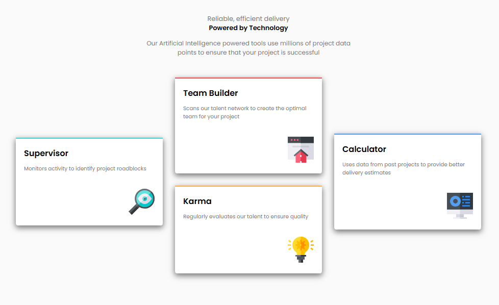

# Frontend Mentor - Four card feature section

# Frontend Mentor - Four card feature section

This project is a solution to the Four Card Feature Section challenge on Frontend Mentor. It is built using HTML and CSS. [Four card feature section](https://www.frontendmentor.io/challenges/four-card-feature-section-weK1eFYK). Frontend Mentor challenges help you improve your coding skills by building realistic projects.

## Table of contents

- [Overview](#overview)
  - [The challenge](#the-challenge)
  - [Screenshot](#screenshot)
  - [Links](#links)
- [My process](#my-process)
  - [Built with](#built-with)
  - [What I learned](#what-i-learned)
  - [Continued development](#continued-development)
- [Author](#author)
- [Acknowledgments](#Acknowledgments)

## Overview

### The challenge

A nice layout-based challenge for beginners. This will test anyone who is new to multi-column and responsive layouts.

Your users should be able to:

- View the optimal layout for the site depending on their device's screen size

### Screenshot

### Links

- Solution URL: [here](https://github.com/olahasan/HTML_AND_CSS_Frontend-Mentor_NEWBIE-Four-card-feature-section)

- Live Site URL: [here](https://olahasan.github.io/HTML_AND_CSS_Frontend-Mentor_NEWBIE-Four-card-feature-section/)

## My process

### Built with

- Semantic HTML5 markup
- CSS custom properties
- Flexbox
- CSS Grid
- Mobile-first workflow
- Responsive design

### What I Learned

In this project, I learned how to:

- Use CSS Grid to create a responsive layout.
- Implement CSS custom properties for better maintainability.
- Improve accessibility by using semantic HTML elements.

### Continued Development

In future projects, I plan to:

- Explore more advanced CSS techniques.
- learn, Improve my JavaScript skills to add interactivity.
- Focus on enhancing accessibility and performance.

### Author

Frontend Mentor - @olahasan 
GitHub - @olahasan

### Acknowledgments

Thanks to **Frontend Mentor** for providing this challenge and to the community for their support and feedback
